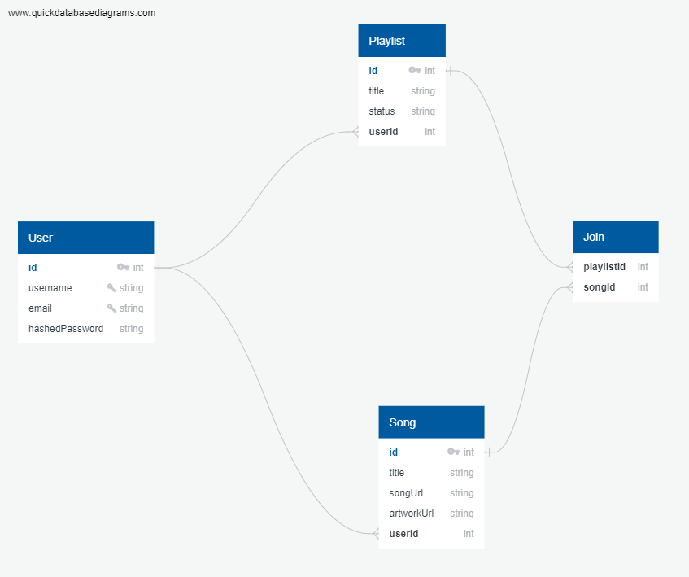
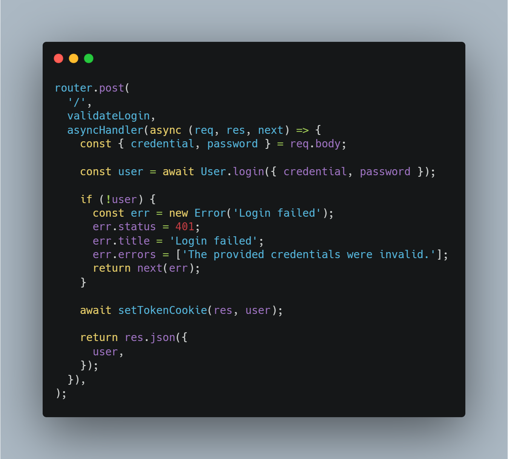
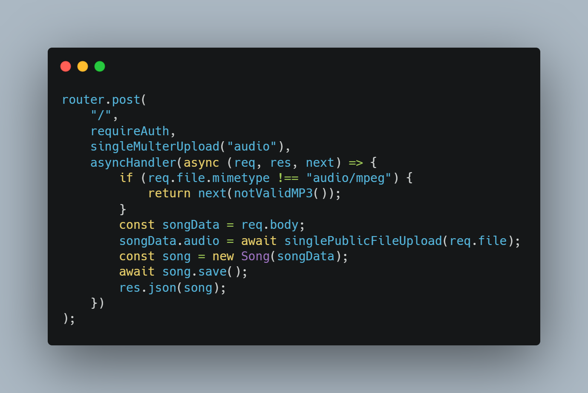
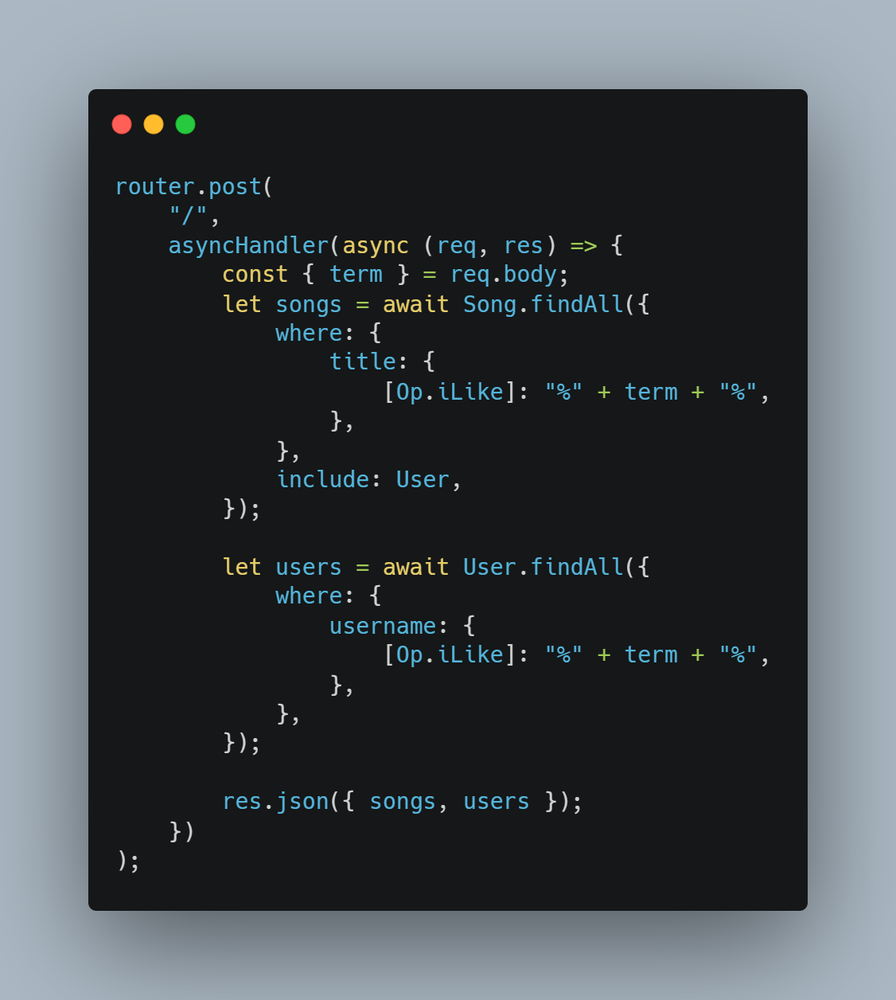

 

**Octour** is a platform for artists to share and listen to music, modeled on [Soundcloud] (https://www.soundcloud.com/). It's design aspect is heavily inspired by [Spotify] (https://www.spotify.com/). It allows users to create and upload songs, view user profiles, and search for other users and songs. It uses RESTful API routes for profiles, session, songs, users, and search.

## Demo

Here is a working live demo: [https://octour.herokuapp.com](https://octour.herokuapp.com)

## Dependencies

Backend dependencies:

-   aws-s3
-   aws-sdk
-   bcryptjs
-   cookie-parser
-   cors
-   csurf
-   dotenv
-   express
-   faker
-   helmet
-   jsonwebtoken
-   morgan
-   multer
-   per-env
-   pg
-   pug
-   sequelize
-   sequelize-cli

Frontend dependencies:

-   jest
-   framer-motion
-   js-cookie
-   react
-   react-dom
-   react-redux
-   react-router-dom
-   react-soundplayer
-   redux
-   redux-thunk
-   styled-components

## Demo

Here is a working live demo: [https://octour.herokuapp.com](https://octour.herokuapp.com)

## Application Architecture

Octour's backend server was built using Express for Node. The server has a RESTful API layer for all CRUD actions and for search. The server is connected to a PostgreSQL database which leverages sequelize and it's ORM for CRUD operations.

The front end is built on React 17. It uses redux to handle global context (state). It also relies heavily on thunk to dispatch async actions. Built purely with react functional components by leveraging react hooks.

---

#### Auth

For authentication the project uses jsonwebtoken and bcrypt for password hashing. For authorization it's using cookie parser to restore the token for API requests. In the front-end I uses js-cookie to extract the cookie set in the backend and a sessionsReducer to add the current user to the global store.

Below is an example of our basic auth functionality.

<!--  -->

## Backend

#### Database

#### Session API

The Session API sets a token cookie upon login, registration, or restoring a user

Below is an example of how the session API works for signing in

#### Search API

The song API allows you to upload a mp3 file which gets uploaded to an awss s3 bucket. Upon uploading you get the chance to upload an artwork along with the song and change the title. The first step is a post request to the server and the second step is a put. This was done this way so that even if a user exits the uploading process half way, the song will still be there

Below is an example of how our song API works for creating a new song record.

 

#### Search API

The search API is fairly simple and uses SQL wildcards to match search terms with song titles and usernames.

Below is an example of how our search API is working for the moment

---

## Pages

### Login (Demo)

### Signup

### Home (Nav preview)

Our homepage is a feed of top questions which are sorted using quicksort! :D

### Question

This is the page you're taken when you click on an individual question

This is the form to create a new question

This is what the question page looks like if you are the owner of the question and the owner of an answer. (for reference)

There is also a page for viewing question's you've posted.

### Search

The search queries by question title and shows results as the image below.

### Voting

We wanted to showcase voting as it is one of the core functionalities on sink overflow.

## Usage

### Development

Want to contribute?

To fix a bug or add a feature, follow these steps:

-   Fork the repository
-   Create a new branch with `git checkout -b feature-branch-name`
-   Make appropriate changes to the files and push back to github
-   Create a Pull Request
    -   Use a clear and descriptive title for the issue to identify the suggestion.
    -   Include any relevant issue numbers in the PR body, not the title.
    -   Provide a comprehensive description of all changes made.

#### Setting Up and Starting a Local Server

1. Download code and `npm install` to install all node dependencies
2. Create a psql db user with createdb privileges.
    - Duplicate the `.env.example` for the `dotenv` package.
    - Update the following variables:
        - `PORT` the port that the server will listen to, 8080 by default
        - `DB_USERNAME` the user of the created psql db user
        - `DB_PASSWORD` the password for the psql db user
        - `JWT_SECRET` a session secret key for encrypting session id's in the database
        - All other variables should remain the same
3. Setup PostgreSQL database
    - Run `npx dotenv sequelize db:create`
    - Run `npx dotenv sequelize db:migrate`
    - Run `npx dotenv sequelize db:seed:all`
4. Start express server by running `npm start` in the root project directory
5. The server will start on `http://localhost:8080`
